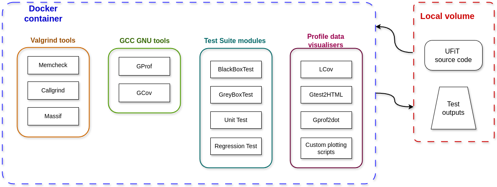

# Individual Research Project

Individual Research Project for CU MSci CompSci degree
The project aims to develop the Test Suite for unit testing and benchmarking scientific software.

- create a set of test routines to be used when new versions are pushed to Github
- evaluate performance on a range of hardware.

Table Of Content:

- [Setup instructions](./docs/Setup.md)
- [Repository architecture](./docs/Architecture.md)
- [Project Roadmap](./docs/RoadMap.md)
- [Project Journal](./docs/Journal.md)

Branches:

main, develop, feature branches, fix branches

