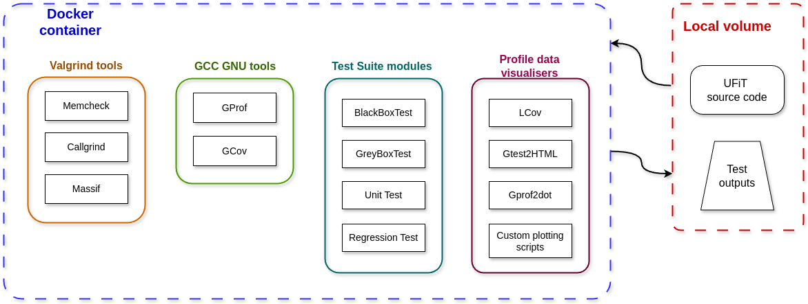

# Test Suite Documentation

## Setup

### Manual Setup

*How to setup the test suite?*

1. Clone this repository
2. Have docker installed: `(sudo) apt-get install docker docker.io`
3. Run `mkdir -p testInput testOutput`
4. `docker --debug build --progress=plain --pull=false -t <image_name> .`
5. `docker --debug run --rm --network none -v $(pwd)/testInput:/ProjectDir/testInput -v $(pwd)/testOutput:/ProjectDir/testOutput -v $(pwd)/docker:/ProjectDir/scripts --name <container_name> <image_name> > ./testOutput/runtime_log.txt 2>&1` 
6. You should see the logs in the command line, or can inspect them with `docker logs -f <container_name>`

After the container stops, you should find the results in the **/testOutputs directory**:
- GoogleTest results **gtest_report.html** can be opened in a browser
- LCov code coverage index.html can be opened in a browser

### Automated Setup

Run the setup script: `./setup_script.sh` will show the options

### Notes

*Step 4* ensures the reusability of the docker image built in *Step 3*. After building the base image, the container will read the input files every time it is run. Additionally *Step 4* automatically removes the container and its associated anonymous volumes when it exits.

Rootless mode is highly advised: https://docs.docker.com/engine/security/rootless/

For offline use, you can run `docker -f OfflineDockerFile`

## Repository Architecture

Repository architecture is as follows:

- root: Dockerfile for running Docker container, and the README,
- /.github: github workflow directory for automated tests,
- /docker: contains the main script, its config file, and the python venv requirements,
- /docs: documentation directory,
- /target [*automatically created*]: directory for target source code UFiT
- /testOutputs: output of the test suite, including figure(s), data, log(s), and html dir
- /testSuite:
    - /testSuite/addons: Python script(s) for mainly plotting the profiling data
    - /testSuite/src: source file(s) of the unit test(s)
    - /testSuite/include: header file(s) of the unit test(s)
    - /testSuite/goldenFiles: golden files for checking outputs or inputs
- /testInputs:
    - ufit.dat

## Fortran Interoperability

### Files

### Modules

### Subroutines

`extern "C"`

`void __ufit_functions_fortran_MOD_intercept_boundary_c000(double* pos_in, double* direction, double* delta_out);`

### Functions

`float __ufit_functions_fortran_MOD_vecdot(float *vec1, float *vec2);`

Functions which utilise built-in Fortran functions such as SQRT() or MIN() need a wrapper subroutine separately. 
Functions which utilise global variables need a setup wrapper to initialise the global variables.

### Global variables

`extern double __ufit_functions_fortran_MOD_grid1max;`

### Local variables

inaccessible

## Test cases

- UFiT_Functions_Fortran normalize_vector()
- UFiT_Functions_Fortran vecdot()
- UFiT_Functions_Fortran find_index()
- UFiT_Functions_Fortran_find_index_irregular()
- UFiT_Functions_Fortran intercept_boundary_c010()
- UFiT_Functions_Fortran intercept_boundary_c100()
- UFiT_Functions_Fortran initialize_variables()

## Test Suite Extensibility

The main script running the tests can be found in the /docker directory called **list_of_commands.sh**. This script is fairly easily modifiable, since it is a bash script with rich comments.

Phases and subprocesses can be changed or skipped, according to desired run time and results. To do this, comment out the line and optionally change the logs to reflect the ignore of the process.

In case any new 3rd Party Software is introduced to the UFiT, and is mandatory for the testing, then it should also be added to the Test Suite in the following way:

- if it is a Python dependency, then appending it to the **/docker/requirements.txt** file should be enough.
- if it is a free software, such as **git**, then it should be added to the **Dockerfile** file, and the script.
- if it is a licenced software, such as 'Intel V-Tune', then it should be added in the **list_of_commands.sh** file, and needs to be downloaded, unpacked, installed, built, and linked (the GTest installation is an example for this case).

> Important note: if the UFiT repository structure, or any file name, or any source code is changed which affects the command line functionality, then the Test Suite should be altered accordingly, to reflect the changes.


### GoogleTest

Unit tests are written in C++ ([docs](https://en.cppreference.com/w/)) and it uses GoogleTest framework ([docs](https://google.github.io/googletest/)). In order to extend the test suite with new unit tests, developers can add a new `TEST()` section inside the appropriate source file in the **src/** directory, in the following way:
 
```c++
TEST(Test_Category, Test_Feature_or_Component)
```

All the unit tests require an assertion or expectation inside the test body.

`EXPECT_` or `ASSERT_`

Either use default main function generated by GTest, or at the bottom of the source file, add your own main function, which should include:

```c++
::testing::InitGoogleTest(&argc, argv);
return RUN_ALL_TESTS();
```

Unit tests can also be disabled for particular feature testing, by inserting the following line inside the test body:

```c++
GTEST_SKIP() << "REASON";
```

Then, after compiling the source files with the GTest libraries, the executable will run the tests sequentially.

### Plotting

Plotting scripts can be added to the addons/ directory, and then linked inside the script PLOTTING section

## Docker notes

Docker is used for a completely isolated virtual environment, to make sure runs are reproducible. This setup uses:
- multi-stage separation, where the builder stage handles the GoogleTest installation, and the main dependencies, while the runner stage starts your final image.
- layer optimization to create fewer layers by chaining commands with '&&' and backslashes.
- cache cleanup: `rm -rf /var/lib/apt/lists/*` ensures the ubuntu image to not keep a cache of available packages inside the image
- additional packages avoided: this prevents the ubuntu base image from installing extra packages with `--no-install-recommends`



Figure of the docker container tasks and the local volume relations.

The docker container has access to the local drive, and fetches the input directory content before each run. Additionally places the output data into the output directory for the user.

> In case of storage overflow, run `docker -D ps` to see the built images.

## CICD

*Using Github Actions*

Github Actions can be configured to run the test suite everytime a push or better a pull request is created for UFiT. Then the CICD pipeline will run a test with the current feature to test it.


## TODO

- develop a technique to address and intercept Fortran data in a CPP function
- create a set of test routines to be used, when new versions are pushed to Github ✅
- evaluate performance on a range of hardware.
- UFiT Makefile suggestion: the Makefile could include a make clean & make profiling sections with the appropriate flags: `make FFLAGS="-O3 -fopenmp -pg -fprofile-arcs -ftest-coverage"` 

*10. April, 2026*

